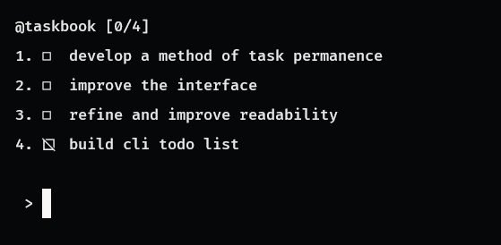

# ✔️ CLI Todo list

 

A CLI-based task management tool. Built using RUST as a research project.

### 📌 How to use ? 

The tool works through commands:
- `@new [text]`: add a task
- `@update [index] [text]`: update the text of a task
- `@stauts [index] [null | started | completed]`: update the status of a task
- `@exit`: exit

### 🚀 Progress

- [X] Basic Logic
- [X] Basic Logic
- [X] Command Systems
- [ ] Develop a method of task permanence
- [ ] Improve the interface
- [ ] Fix certain code errors
- [ ] Refine and improve readability

### 📁 Structure
```
Cargo.toml
src/  
    main.rs    # Entrypoint
    task.rs    # Tasks Logic
    input.rs   # Input processing
    printer.rs # Prints
```
